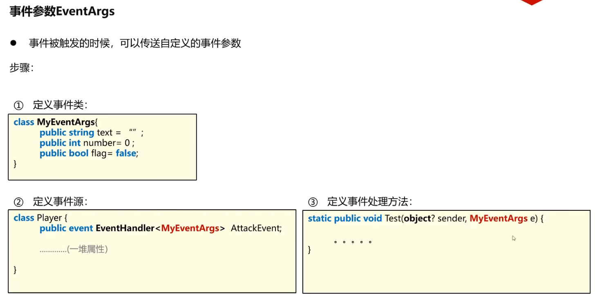

### 94 C#教程-事件参数泛型与练习
#### 1 . 复习上节课
```C#
namespace SeniorEventArgs
{
    class Player {
        public event EventHandler OnAttack = null;
        public void DoAOE() {
            if (OnAttack != null) {
                OnAttack(this, EventArgs.Empty);
            }
        }
    }

    class Enemy {
        public void AttackMe(object? sender, EventArgs e) {
            Console.WriteLine("好疼啊，敌人被攻击了");
        }
    }

    internal class Program
    {
        static void Main(string[] args)
        {
            Player p = new Player();
            Enemy e = new Enemy();

            p.OnAttack += e.AttackMe;
            p.DoAOE();
        }
    }
}
```
#### 2 . 自定义EventArgs
  
对EventHandler右键转到定义，可以看到用了泛型。  
  
```C#
/*
 * 事件参数泛型
 * 1 定义自己的事件参数包class
 * 2 将EventHandler特化成传输咱们自己的参数包类的委托类型
 * 3 响应方法中，将事件参数包类型替换成我们自己的参数包类型
 */
namespace SeniorEventArgs
{
    class MyArgs {
        public int attack = 0;
        public bool poisoned = false;
        public bool headache = false;
    }
    class Player {
        public event EventHandler<MyArgs> OnAttack = null;
        public void DoAOE() {
            if (OnAttack != null) {
                MyArgs args = new MyArgs();
                args.attack = 10;
                args.poisoned = true;
                args.headache = true;

                OnAttack(this, args);
            }
        }
    }

    class Enemy {
        public void AttackMe(object? sender, MyArgs args) {
            Console.WriteLine("好疼啊，敌人被攻击了");
            Console.WriteLine("攻击力：" + args.attack);
            Console.WriteLine("是否中毒："+args.poisoned);
            Console.WriteLine("是否眩晕："+args.headache);
        }
    }

    internal class Program
    {
        static void Main(string[] args)
        {
            Player p = new Player();
            Enemy e = new Enemy();

            p.OnAttack += e.AttackMe;
            p.DoAOE();
        }
    }
}
```
#### 3 . 事件练习（一）键盘输入管理类
  
换句话说：  
咱们new了一个InputManager对象，里面有OnKeyInput的事件。当键盘被敲击一下之后，并且点一下回车，相当于用户输入了一个字符，随后InutManager收到了这样的消息之后，调用OnKeyInput这样的事件，对外发布说这个用户输入了一个字符。

`要求:使用自定义事件，将键盘输入的字符给到订阅者`means：需要有其他的类监听OnKeyInput事件。比如当用户点了一个'w',OnKeyInput事件就会触发。触发的同时，要传导一个参数包给到其他的监听者。参数包里放用户输入的char类型。  
```C#
/*
 * Input Manager 练习
 * 
 * 编写一个InputManager的Class，用来接收用户输入的一个字符，之后调用OnInput事件，本事件会
 * 传导给监听者两个东西（object sender, InputArgs args），args里面携带着用户输入的字符
 */
namespace SeniorEventExampleInputManager
{
    class InputArgs { public char input; }
    class InputManager {
        public event EventHandler<InputArgs> OnInput;
        public void WaitForInput() {
            while (true) {
                //1 读取用户输入的一个字符
                char input = Convert.ToChar(Console.Read());
                //Console.Read()会停下来等待用户输入。

                //2 调用OnInput事件，将这个字符传导到监听方法/监听者
                if (OnInput != null) {
                    InputArgs args = new InputArgs();
                    args.input = input;

                    OnInput(this, args);
                }
            }
        }
    }
    internal class Program
    {
        static public void OnKeyInput(object sender, InputArgs args) {
            Console.WriteLine("收到了OnInput事件，拿到了字符："+args.input);
        }
        static void Main(string[] args)
        {
            InputManager im = new InputManager();
            im.OnInput += OnKeyInput;

            im.WaitForInput();
        }
    }
}
```
输出：会多空格是Console.Read()的缺陷。  
```
a
收到了OnInput事件，拿到了字符：a
收到了OnInput事件，拿到了字符：
收到了OnInput事件，拿到了字符：
```
im.了之后  
  
当它是一个小闪电说明OnInput是一个event事件，我们可以用咱们自己的一些方法加入到这个事件里面去监听这个事件的发生。  

#### 4 . 事件练习（二）喂食宠物
  
```C#
/*
 * 喂食宠物
 * 模拟主任喂食宠物的过程，三只宠物狗/猫/熊猫
 * 事件源：主人（OnFeed）
 * 监听者：狗 猫 熊猫，Eat
 * 事件参数包：string food
 */
namespace SeniorEventExampleFeedAnimals
{
    class FeedArgs {
        public string food = "";
    }

    class Master {
        public event EventHandler<FeedArgs> OnFeed;
        public void FeedAnimals(string food) {
            if (OnFeed != null) {
                FeedArgs args = new FeedArgs();
                args.food = food;

                OnFeed(this, args);
            }
        }
    }

    class Dog
    {
        public void Eat(object sender, FeedArgs args)
        {
            if (args.food != "肉肉")
            {
                Console.WriteLine("狗狗：不爱吃不爱吃！！");
            }
            else
            {
                Console.WriteLine("狗狗：爱吃爱吃");
            }
        }
    }

    class Cat
    {
        public void Eat(object sender, FeedArgs args)
        {
            if (args.food != "鱼鱼")
            {
                Console.WriteLine("猫猫：不爱吃不爱吃！！");
            }
            else
            {
                Console.WriteLine("猫猫：爱吃爱吃");
            }
        }
    }

    class Panda
    {
        public void Eat(object sender, FeedArgs args)
        {
            if (args.food != "竹子")
            {
                Console.WriteLine("熊猫：不爱吃不爱吃！！");
            }
            else
            {
                Console.WriteLine("熊猫：爱吃爱吃");
            }
        }
    }
    internal class Program
    {
        
        static void Main(string[] args)
        {
            Master master = new Master();
            Dog dog = new Dog();
            Cat cat = new Cat();
            Panda panda = new Panda();

            master.OnFeed += dog.Eat;
            master.OnFeed += cat.Eat;
            master.OnFeed += panda.Eat;

            master.FeedAnimals("竹子");
        }
    }
}
```
输出：  
```
狗狗：不爱吃不爱吃！！
猫猫：不爱吃不爱吃！！
熊猫：爱吃爱吃
```
#### 鸦鸦对练习2的改造
目标，想一次性把三种事物都喂了，而且每种动物喂的是它们专门的食物。  
##### 【鸦鸦第一版】  
```C#
/*
 * 喂食宠物
 * 模拟主任喂食宠物的过程，三只宠物狗/猫/熊猫
 * 事件源：主人（OnFeed）
 * 监听者：狗 猫 熊猫，Eat
 * 事件参数包：string food
 */
namespace SeniorEventExampleFeedAnimals
{
    class FeedArgs {
        public string food = "";
    }

    class Master {
        Dictionary<string, string> foodCompare = new Dictionary<string, string>
        {
            {"dog","肉肉" },
            { "cat","鱼鱼"},
            {"panda","竹子" }
        };
        public event EventHandler<FeedArgs> OnFeed;
        public event EventHandler OnName;
        private string name; //想让这个等于当前对应的动物的名字
        public void FeedAnimals() {
            FeedArgs args = new FeedArgs();
            if (OnName != null) {
                OnName(this, EventArgs.Empty);
                args.food = foodCompare[name];
                Console.WriteLine(args.food);
            }
            if (OnFeed != null) {
                OnFeed(this, args);
            }
        }

        public string Name {
            get { return name; }
            set { name = value; }
        }
    }

    class Dog
    {
        private string name = "dog";

        public void GiveNameToMaster(object sender, EventArgs args) {
            Master m = (Master)sender;
            m.Name = name;
        }
        public void Eat(object sender, FeedArgs args)
        {
            if (args.food != "肉肉")
            {
                Console.WriteLine("狗狗：不爱吃不爱吃！！");
            }
            else
            {
                Console.WriteLine("狗狗：爱吃爱吃");
            }
        }
    }

    class Cat
    {
        public string name = "cat";
        public void GiveNameToMaster(object sender, EventArgs args)
        {
            Master m = (Master)sender;
            m.Name = name;
        }
        public void Eat(object sender, FeedArgs args)
        {
            Master m = (Master)sender;
            m.Name = name;
            if (args.food != "鱼鱼")
            {
                Console.WriteLine("猫猫：不爱吃不爱吃！！");
            }
            else
            {
                Console.WriteLine("猫猫：爱吃爱吃");
            }
        }
    }

    class Panda
    {
        public string name = "panda";
        public void GiveNameToMaster(object sender, EventArgs args)
        {
            Master m = (Master)sender;
            m.Name = name;
        }
        public void Eat(object sender, FeedArgs args)
        {
            Master m = (Master)sender;
            m.Name = name;
            if (args.food != "竹子")
            {
                Console.WriteLine("熊猫：不爱吃不爱吃！！");
            }
            else
            {
                Console.WriteLine("熊猫：爱吃爱吃");
            }
        }
    }
    internal class Program
    {
        
        static void Main(string[] args)
        {
            Master master = new Master();
            Dog dog = new Dog();
            Cat cat = new Cat();
            Panda panda = new Panda();

            master.OnName += dog.GiveNameToMaster;
            master.OnName += cat.GiveNameToMaster;
            master.OnName += panda.GiveNameToMaster;

            master.OnFeed += dog.Eat;
            master.OnFeed += cat.Eat;
            master.OnFeed += panda.Eat;

            master.FeedAnimals();
        }
    }
}
```
输出：  
```
竹子
狗狗：不爱吃不爱吃！！
猫猫：不爱吃不爱吃！！
熊猫：爱吃爱吃
```
一开始想的是先获取动物的名字，然后再把名字对应的食物传给OnFeed函数。  
可是Master类只有一个name（所获取的动物名字），也只有一个args。  
且`OnFeed(this,args)`中的参数this和args在三个动物订阅方法中都是同一个，没法变更。  

分析：  
  
  

##### 【鸦鸦第二版】  
把三种食物递给狗，狗从三个食物中挑选自己的食物。  
把三种食物递给猫，猫从三个食物中挑选自己的食物。  
把三种食物递给熊猫，熊猫从三个食物中挑选自己的食物。  
```C#
/*
 * 喂食宠物
 * 模拟主任喂食宠物的过程，三只宠物狗/猫/熊猫
 * 事件源：主人（OnFeed）
 * 监听者：狗 猫 熊猫，Eat
 * 事件参数包：string food
 */
namespace SeniorEventExampleFeedAnimals
{
    class FeedArgs {
        public string food = "";
        public FeedArgs(string _food) { food = _food; }
    }

    class Master {
        public Dictionary<string, int> foodCompare = new Dictionary<string, int>
        {
            {"Dog",0 },//第0号事物是肉肉
            { "Cat",1},
            {"Panda",2 }
        };
        
        public event EventHandler<FeedArgs[]> OnFeed;
        public void FeedAnimals() {
            FeedArgs[] args = { new FeedArgs("肉肉"), new FeedArgs("鱼鱼"), new FeedArgs("竹子") };//传进的是数组
            if (OnFeed != null) {
                OnFeed(this, args);
            }
        }

    }

    class Dog
    {
        private string name = "Dog";
        public void Eat(object sender, FeedArgs[] args)
        {
            Master m = (Master)sender;
            string myFood = args[m.foodCompare[name]].food;//m.foodCompare[name]获取食物编号，args[编号].food就是食物
            if (myFood != "肉肉")
            {
                Console.WriteLine("狗狗：不爱吃不爱吃！！");
            }
            else
            {
                Console.WriteLine("狗狗：爱吃爱吃");
            }
        }
    }

    class Cat
    {
        private string name = "Cat";
        public void Eat(object sender, FeedArgs[] args)
        {
            Master m = (Master)sender;
            string myFood = args[m.foodCompare[name]].food;
            if (myFood != "鱼鱼")
            {
                Console.WriteLine("猫猫：不爱吃不爱吃！！");
            }
            else
            {
                Console.WriteLine("猫猫：爱吃爱吃");
            }
        }
    }

    class Panda
    {
        private string name = "Panda";
        public void Eat(object sender, FeedArgs[] args)
        {
            Master m = (Master)sender;
            string myFood = args[m.foodCompare[name]].food;
            if (myFood != "竹子")+
            {
                Console.WriteLine("熊猫：不爱吃不爱吃！！");
            }
            else
            {
                Console.WriteLine("熊猫：爱吃爱吃");
            }
        }
    }
    internal class Program
    {
        
        static void Main(string[] args)
        {
            Master master = new Master();
            Dog dog = new Dog();
            Cat cat = new Cat();
            Panda panda = new Panda();

            master.OnFeed += dog.Eat;
            master.OnFeed += cat.Eat;
            master.OnFeed += panda.Eat;

            master.FeedAnimals();
        }
    }
}
```
输出：  
```
狗狗：爱吃爱吃
猫猫：爱吃爱吃
熊猫：爱吃爱吃
```
##### 鸦鸦的总结
  
