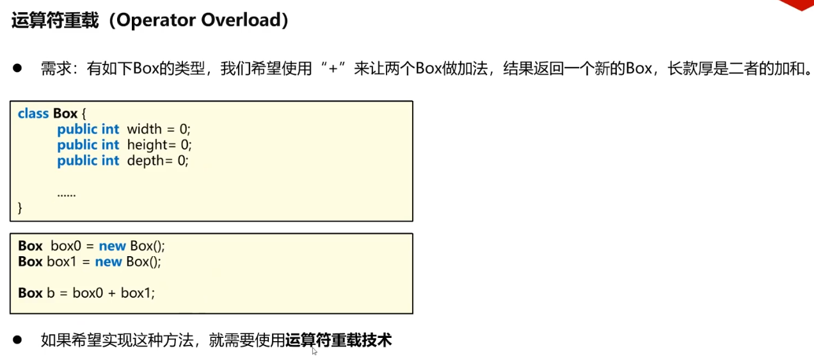

### 95 C#教程-运算符重载（一）  
以前学过的“方法的重载”，  
两个方法在同一个类内，这两个方法名字一模一样，但是它们的参数列表不同，所以它们构成了重载。  

学过的运算符：  
（1）=-*/算数运算符，  
（2）++，--这种自增自减的运算符，  
（3）类型转换的运算符（隐式类型转换，显式类型转换）  

#### 1 . 什么是运算符重载
  

【把符号看成方法】：  
```C#
int a = 5;
int b = 5;
int c = a+b;
```
之前把这个加号简简单单当成一个运算符，运算符连接两端的操作数，形成一个表达式。  
但是在编程语言更加深层次的理解里面，可以把+号看成一个方法，或者说一个函数。把`a+b`看作一次方法的调用的话。  
+号是方法的名字：  
int + (int v1, int v2){return v1+v2;}  

  
- 双目运算符：运算符的两边分别有两个东西进行相加或相减。  
- 单目运算符：（++，--，变成负号的-）  

##### 【双目运算符】 
双目运算符代码：  
```C#
using System.Runtime.Intrinsics.X86;

namespace SeniorOperatorOverload
{
    class Box {
        private int width = 0;
        private int height = 0;
        private int depth = 0;
        public Box(int _width, int _height, int _depth) {
            width = _width;
            height = _height;
            depth = _depth;
        }
        public Box() { }

        public void Print() {
            Console.WriteLine("width:" + width + "\n" + "height:" + height + "\n" + "depth:" + depth);
        }

        //重载+运算符
        public static Box operator +(Box box1, Box box2) { 
            Box box = new Box();
            box.width = box1.width + box2.width;
            box.height = box1.height + box2.height;
            box.depth = box1.depth + box2.depth;

            return box;
        }

        //重载-运算符
        public static Box operator -(Box box1, Box box2)
        {
            Box box = new Box();
            box.width = box1.width - box2.width;
            box.height = box1.height - box2.height;
            box.depth = box1.depth - box2.depth;

            return box;
        }
    }
    internal class Program
    {
        static void Main(string[] args)
        {
            Box b0 = new Box(10,10,10);
            Box b1 = new Box(20,20,20);

            //Box b = Box.operator(b0,b1);
            Box b = b0 + b1;
            b.Print();

            Box bb = b0 - b1;
            bb.Print();
        }
    }
}
```
##### 【单目运算符】  
  
这道题是说向量：   
  

这样写前加加的运算符重载的话：  
  
  
这句话是指向同一片内存，所以当：  
```C#
using System.Runtime.Intrinsics.X86;

namespace SeniorOperatorOverload
{
    class Vector2 {
        public int x;
        public int y;
        public Vector2(int _x, int _y) {
            x = _x;
            y = _y;
        }
        public Vector2() { }
        //单目运算符中的++/--
        //a++：后缀++，先参与表达式运算，再+1
        //++a：前缀++，先+1，再参与运算
        //前++，++v
        public static Vector2 operator ++(Vector2 v) {
            v.x += 1;
            v.y += 1;
            return v;
        }

        public void Print() {
            Console.WriteLine("向量:("+x+", "+y+" )");
        }
    }
    internal class Program
    {
        static void Main(string[] args)
        {
            //向量类单目
            Vector2 v = new Vector2(9, 10);

            Vector2 vplus = ++v;
            vplus.Print();
            vplus.x = 100; //对应的v的x也发生了改变
            v.Print();
            vplus.Print();
        }
    }
}
```
输出：  
```
向量:(10, 11 )
向量:(100, 11 )
向量:(100, 11 )
```
//这里换成Vector2 vplus = v++;会是同样的结果。  
在这种情况下C#中没有办法区别前++和后++  
详情见下面的分析：  

#### 2 . ++运算符的详细分析【鸦的分析】
用这串代码来分析：
```C#
using System;
using System.Runtime.Intrinsics.X86;

namespace SeniorOperatorOverload
{
    class Vector2
    {
        public int x;
        public int y;
        public Vector2(int _x, int _y)
        {
            x = _x;
            y = _y;
        }
        public Vector2() { }
        public Vector2 ShallowCopy()
        {
            return (Vector2)this.MemberwiseClone(); // 浅复制，只复制对象的字段值，而不复制引用类型的实例
        }

        //单目运算符中的++/--
        //a++：后缀++，先参与表达式运算，再+1
        //++a：前缀++，先+1，再参与运算
        public static Vector2 operator ++(Vector2 v)
        {
            Vector2 nv = new Vector2();//让nv是（0,0）了
            nv.x = 1;
            nv.y = 1;
            v.x = 6;
            v.y= 6; 
            return v;
        }

        public void Print()
        {
            Console.WriteLine("向量:(" + x + ", " + y + " )");
        }
    }
    internal class Program
    {
        static void Main(string[] args)
        {
            //向量类单目
            Vector2 v = new Vector2(10, 10);
            Vector2 vplus = ++v;
            v.Print();
            vplus.Print();
            vplus.x = 100; //对应的v的x也发生了改变
            v.Print();
            vplus.Print();
        }
    }
}
```
   
怎么测试：return v;测试v++；和++v；(两种情况)  
return nv;测试v++；和++v；（两种情况）  
【测试结果：】  
当Vector2 vplus = ++v;  
v和vplus绑定到一起了，所以vplus = v = "重载函数return的值"。  

当Vector2 vplus = v++;  
v和vplus两者没有绑定。  
v = "重载函数return的值"（return v或者return nv这个值不同）。    
vplus = "重载函数体内v的赋值"。  

---
https://stackoverflow.com/questions/22963432/c-sharp-operator-overloads-do-i-need-to-deep-copy

所以如果搞不清楚不想两者绑定，最好用一个非重载的函数：e.g.  
这个写在Vector2类内
```C#
        public Vector2 Jiara() {
            Vector2 nv = this.ShallowCopy();
            this.x += 1;
            this.y += 1;
            return nv;
        }
```

---
关于深浅复制：  
   
上面那张图的等价于是我瞎写的，不一定对
https://cloud.tencent.com/developer/article/2320968

#### 3 . 修改老师单目++的那个案例
首先测试一下int值的加加操作：  
```C#
int x = 0;
int y = ++x;
Console.WriteLine("++x ：");
Console.WriteLine("x:" + x+ ",  y: "+y);
y = 10;
Console.WriteLine("x:" + x + ",  y: " + y);

int xx = 0;
int yy = xx++;
Console.WriteLine("xx++ ：");
Console.WriteLine("xx:" + xx + ",  yy: " + yy);
yy = 10;
Console.WriteLine("xx:" + xx + ",  yy: " + yy);
```
结果：
```
++x ：
x:1,  y: 1
x:1,  y: 10
xx++ ：
xx:1,  yy: 0
xx:1,  yy: 10
```
++x返回递增后的x值，++x返回递增前的x值。  
可以看到x与y并没有绑定到一起。  

由上面的测试知道重载的前加加是会绑定两者的，所以暂时没有好的修改办法。  

这个课老师的原始代码见下（有缺陷）：    
下面这张图他想写前加加  
  

下面这张图他想写后加加  
  

他认为：   
  
但其实：   
后加加与前加加虽然调用同一个重载方法，背后的v和vplus取值却有所区别。   

#### 4 . 鸦鸦整理所有代码
```C#
using System.Runtime.Intrinsics.X86;

namespace SeniorOperatorOverload
{
    class Box
    {
        private int width = 0;
        private int height = 0;
        private int depth = 0;
        public Box(int _width, int _height, int _depth)
        {
            width = _width;
            height = _height;
            depth = _depth;
        }
        public Box() { }

        public void Print()
        {
            Console.WriteLine("width:" + width + "\n" + "height:" + height + "\n" + "depth:" + depth);
        }

        //重载+运算符
        public static Box operator +(Box box1, Box box2)
        {
            Box box = new Box();
            box.width = box1.width + box2.width;
            box.height = box1.height + box2.height;
            box.depth = box1.depth + box2.depth;

            return box;
        }

        //重载-运算符
        public static Box operator -(Box box1, Box box2)
        {
            Box box = new Box();
            box.width = box1.width - box2.width;
            box.height = box1.height - box2.height;
            box.depth = box1.depth - box2.depth;

            return box;
        }
    }

    class Vector2
    {
        public int x;
        public int y;
        public Vector2(int _x, int _y)
        {
            x = _x;
            y = _y;
        }
        public Vector2() { }

        public Vector2 ShallowCopy()
        {
            return (Vector2)this.MemberwiseClone(); // 浅复制，只复制对象的字段值，而不复制引用类型的实例
        }

        //实现双目运算符-减法
        public static Vector2 operator -(Vector2 left, Vector2 right)
        {
            Vector2 v = new Vector2();
            v.x = left.x - right.x;
            v.y = left.y - right.y;
            return v;
        }

        //实现单目运算符取反-
        public static Vector2 operator -(Vector2 vi)
        {
            Vector2 nv = new Vector2();
            nv.x = -vi.x;
            nv.y = -vi.y;

            return nv;
        }

        //单目运算符中的++/--
        //a++：后缀++，先参与表达式运算，再+1
        //++a：前缀++，先+1，再参与运算
        //前++，++v
        public static Vector2 operator ++(Vector2 v)
        {
            ////Vector2 nv = new Vector2(v.x + 1, v.y + 1);
            //Vector2 nv = new Vector2();//让nv是（0,0）了
            //nv.x = 1;
            //nv.y = 1;
            //v.x = 6;
            //v.y = 6;
            //return v;

            //Vector2 nv = v.ShallowCopy();
            //v.x += 1;
            //v.y += 1;
            //return nv;

            v.x += 1;
            v.y += 1;
            return v;
        }

        public void Print()
        {
            Console.WriteLine("向量:(" + x + ", " + y + " )");
        }
    }
    internal class Program
    {
        static void Main(string[] args)
        {
            //Box类双目运算符
            Box b0 = new Box(10, 10, 10);
            Box b1 = new Box(20, 20, 20);

            //下面这句话相当于Box b = Box.operator(b0,b1);
            Box b = b0 + b1;
            b.Print();

            Box bb = b0 - b1;
            bb.Print();

            //向量类单目，双目运算符
            Vector2 v0 = new Vector2(5, 4);
            Vector2 v1 = new Vector2(2, 2);

            Vector2 nv = -v0;
            Vector2 minusV = v0 - v1;

            nv.Print();
            minusV.Print();

            //向量类单目
            Vector2 v = new Vector2(10, 10);

            Vector2 vplus = ++v;
            vplus.Print();
            vplus.x = 100; //对应的v的x也发生了改变
            v.Print();
            vplus.Print();
        }
    }
}
```

#### 5 . 补充
去搜了微软官方的C#标准库源码：  
https://referencesource.microsoft.com/#q=unary%20operator  
用unary operater去搜，没搜到什么    
全称叫做：  
Overload unary decrement operator  
Overload unary increment operator  