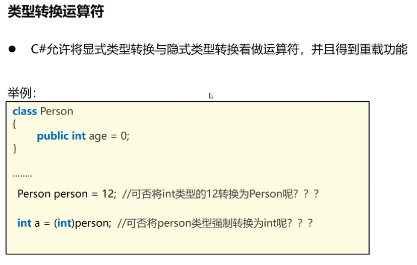
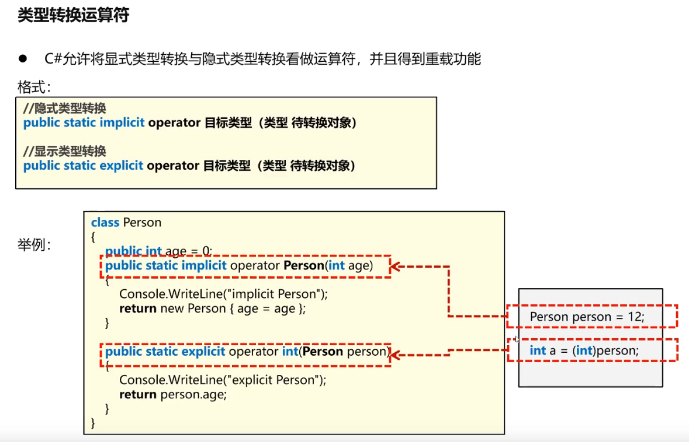
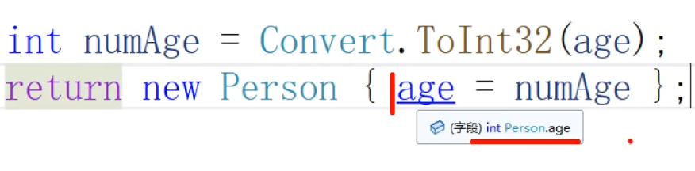
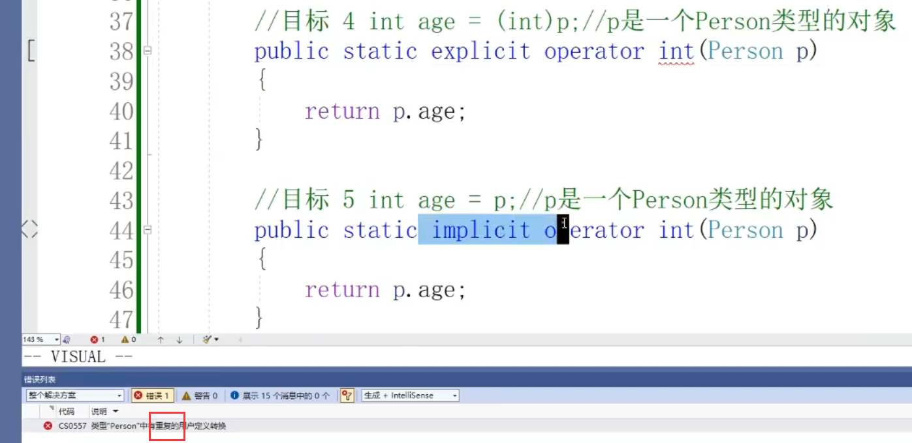

### 96 C#教程-运算符重载（二）
**隐式类型转换**：将一个取值范围较小的数字装到一个取值范围较大的数字里。  
float a = 5;//将int型的数据装入float变量里面  
double b = 1.25f;//将float类型的数据装入double变量里面  

**显式类型转换**（强制类型转换）：将一个取值范围较大的数字，装到一个取值范围较小的变量里面。  
int c = (int) 1.5f;  
#### 1 . 类型转换运算符
  
Person person = 12;  
生成一个age=12的Person对象。  
理解为：用12生成了一个对象。 

int a = (int)pewson;  
理解为：将对象里面的整数提取出来。  

Person p = (Person)12;  
虽然是数字生成了一个对象，但用的是强制转换。  
   
return new Person{age = age};  
//编译器默认将等号前面的家伙认为是类内的某个字段，等号后边的认为是类外的某个参数。  
  

Person person = 12;这一句代码所调用的方法其实就是这样隐式类型转换。它怎么调用的呢？在执行这句代码的时候它发现，12是个int，这个person是一个Person类型的对象，他俩不是一个类型。所以会去Person类里面找有没有实现这样类型转换的重载方法。12前没有小括号，所以这是一个隐式类型转换。再定位到待转换对象是int的那个隐式类型转换方法。  
```C#
using System.Runtime.Intrinsics.X86;

namespace SeniorOperatorOverload
{
    class Person {
        public int age = 0;
        public string name = "default";

        //目标 1 Person p0 = 12;
        public static implicit operator Person(int age) {
            Person person = new Person();
            person.age = age;
            return person;
        }

        ////目标 2 Person p1 = "carmazhao";//打开这条需注释目标3
        //public static implicit operator Person(string name) {
        //    Person p = new Person();
        //    p.name = name;
        //    return p;
        //}

        //目标 3 Person p3 = "12"; //打开这条需注释目标2
        public static implicit operator Person(string age)
        {
            int numAge = Convert.ToInt32(age);
            return new Person { age = numAge };
        }

        ////目标 4 int age0 = (int)p; // p是一个Person类型的对象//打开这条需注释目标5
        //public static explicit operator int(Person p) {
        //    return p.age;  
        //}

        //目标 5 int age1 = p; // p是一个Person类型的对象//打开这条需注释目标4
        public static implicit operator int(Person p)
        {
            return p.age;
        }

        public void Print() {
            Console.WriteLine($"NAME: {name}, AGE: {age}");
        }
    }
    internal class Program
    {
        static void Main(string[] args)
        {
            //隐式类型转换实验
            Person p0 = 12;
            p0.Print();
            //Person p1 = "carmazhao"; //目标2（矛盾于目标3）
            //p1.Print(); //目标2（矛盾于目标3）
            Person p2 = "12"; //目标3（矛盾于目标2）
            p2.Print(); //目标3（矛盾于目标2）

            //对象转成int值
            Person p = new Person();
            p.age = 100;
            //int age0 = (int)p; //显式转换(矛盾于隐式转换)
            //Console.WriteLine(age0);//显式转换(矛盾于隐式转换)
            int age1 = p;//隐式转换(矛盾于显式转换)
            Console.WriteLine(age1);//隐式转换(矛盾于显式转换)
        }
    }
}
```

目标4和目标5矛盾原因：把一个类型转化为另一个类型，要么你选择让它是显式，要么是隐式，不能共存。

  


往往在做项目的时候，希望说你在构造一个Person对象的时候，让它等于一个简单的值类型，Person p0 = 100;这个方式比较欢迎。

对于目标5：但是使用Person对象直接赋值给一个简单的值类型：int age = p0; 这种方式不太欢迎。因为这样会导致其他程序员心里十分混乱。推荐使用显式类型转换。