### 97 C#教程-内存垃圾回收机制（一）
#### 1 . 
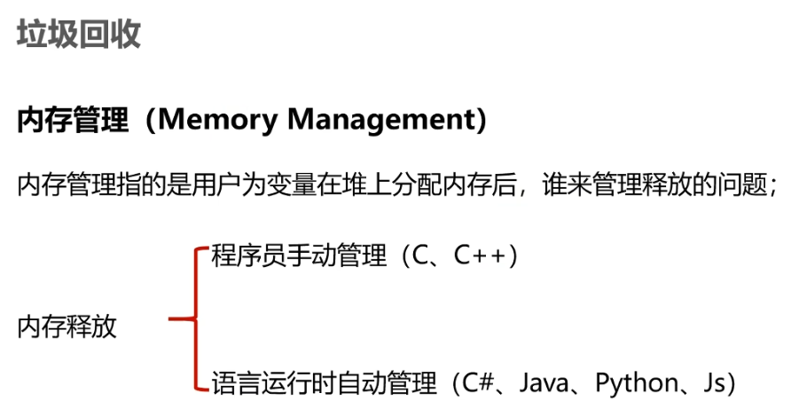  
之前经常使用new这个关键字，咱们经常说new关键字是在堆内存上划出了这么一块内存空间。然后在这里面放上去当前这个class所需要的成员变量，将这块内存的地址给到栈内存上的一个引用类型的变量。这个变量是在程序中写的对象。

咱们一直没有说用户在堆上分配了内存后，什么时候把它消灭掉呢？如果你不停去分配的话，堆内存早晚有一天不够用了，所以肯定有释放的一个流程。在栈内存上咱们比较清楚，当一个方法压入栈内存的时候，这个方法里面分配的简单的变量，这些简单的值类型会随着方法的完成弹栈之后，这些内存在栈内存上随着方法消失了。但是堆内存上我们没有去讲解。

C、C++需要程序员手动管理堆内存。

什么是语言运行时：“语言运行时”在C#里面是CLR（common language runtime），就是由这个CLR来调起程序去运行，去解释当中的中间语言，一句一句去执行。发现了里面需要new内存的时候，人家CLR帮咱们去搞了一块堆内存出来。根据CLR内部算法的判断说这块内存没有必要了，它就会帮助我们自动地释放它。  
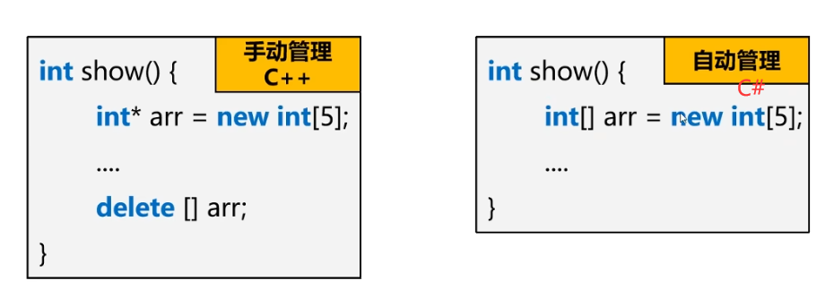  
C++中指针和C#的引用类型非常像。麻烦事：很多程序员忘了这件事，并又没在show方法退出之前去做delete。当show（）方法退出之后，虽然这个小arr已经随着栈内存而消灭掉了，可是它所new的这块内存空间仍然在堆内存上占据着。

所以如果你频繁地调用show函数就会导致new这个操作反复地做，堆就会变得非常拥挤。  
#### 2 . 
CLR是如何觉得这块内存应该被释放或者说应该被保留的呢？接下来我们会讲：
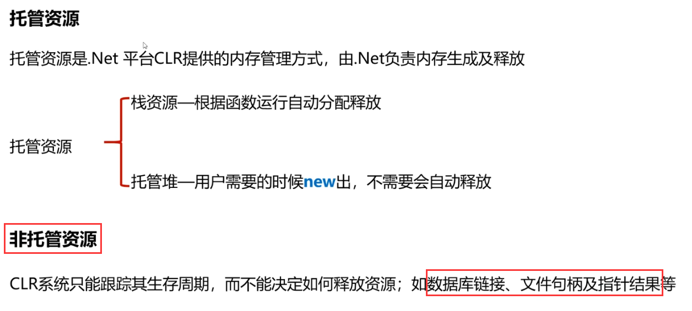  
我们学方法函数的时候，当一个方法被压入栈中，方法里面的分配的这些值类型变量分配到栈内存，方法运行完之后把临时变量都清除。【以前讲的方法的内存分配】

托管资源和非托管资源不要把思路局限在内存上，内存是一种咱们可以使用的资源，还有哪些资源呢？如数据库链接、文件句柄及指针结果等。  

连接这个数据库你需要拿到钥匙打开数据库的门，当你用完这个数据库把它锁上。门数量有上限。

文件摆到硬盘上e.g. txt，word文档。操作系统你打开一个文件读取它里面的内容，再打开一个文件读取里面的内容，总共能够打开文件的上限其实是确定的。能打开文件的数目即**文件的句柄**是越来越少的。  
【鸦补充】e.g. 
```C#
TextReader reader = new StreamReader(inputStream.AsStreamForRead());
displayData(reader);

reader.Dispose;
//将释放与文件关联的资源并关闭文件。这是一个好习惯。除了释放访问文件所需的内存和其他资源，还使其他应用程序能使用该文件。
```

C#里也可以使用C++的指针这个概念，但是，并不推荐。

为什么托管不了“非托管资源”？  
数据库的链接，就是你开这个门进去再把门关上出来这件事由用户完全自主决定。CLR是完全不知道我该什么时候给你关上这扇门的。

#### 3 . 
接下来咱们把视线收回到“堆内存”，看堆内存上如何做垃圾回收。  
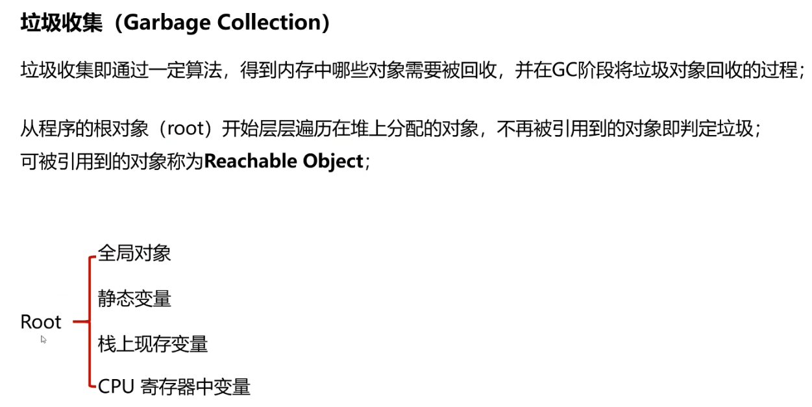  
根对象称为Root，也就是那一些当前还没有被释放内存的对象。全局对象。比如说像单例模式生成的对象就是全局唯一而且是跟着程序从头走到尾的对象。还有静态变量是随着类加载而生成随着程序的退出而消灭的。全局对象和静态变量是一直都存在的。

判定这些对象哪些是可达的哪些应该被丢弃，判定这件事应该在程序运行的某一时刻来进行。这一刻CLR判定哪些对象该被收集掉。**见下图**，比如说栈上压进来两个方法，A方法，B方法，B方法空间里有两个变量，A方法空间里有两个变量。在当时当下，这些变量存在在栈上，说明咱们程序的运行需要它们。所以“栈上现存变量”也是此时此刻不能被回收的。
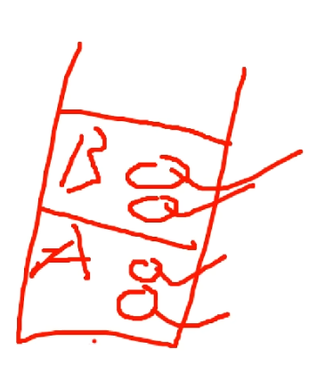 

栈内存摆着4个变量（AB方法的），需要把这些变量读到CPU里然后才能执行运算，CPU里有小的内存能存储这些临时数据，就叫做寄存器。
“栈上现存变量”和“CPU寄存器中变量”都是此时此刻我们是需要它们的。  
 
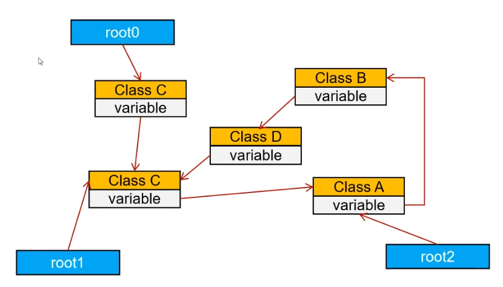  
root0对象里面有一个Class C 类型的对象。  
可以理解成root0是一个Person类型的对象，Class C是Person类里面含的一个宠物对象。当人一直存在，里面所包含的宠物对象也一直存在。这个C类型的对象里又包含一个C类型的对象。  
Class C对象被root0和root1两个对象引用了。  

体会这句话`从程序的根对象（root）开始层层遍历在堆上分配的对象，不再被引用到的对象即判定垃圾;可被引用到的对象称为Reachable Object;`  

从root0出发可以包括：（C,C,A,B,D）  
从root1出发可以包括：（C,,A,B,D）  
从root2出发可以包括：（C,A,B,D）  

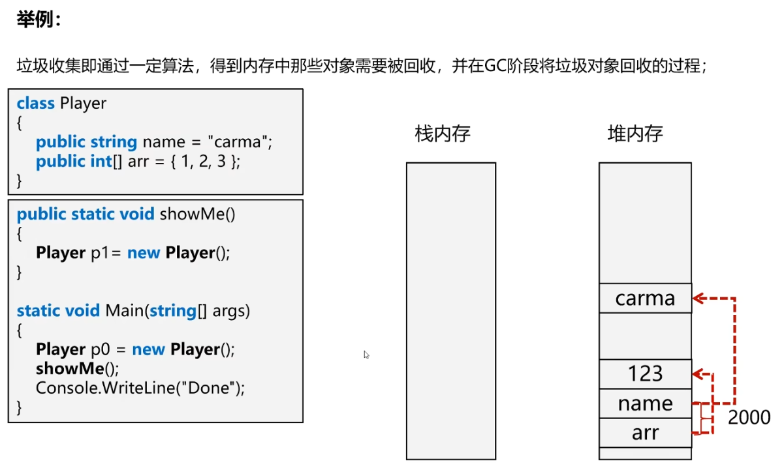  
咱们接下来看在堆栈上到底是怎么做到的？  
Player p0 = new Player();  
new的时候这个Player要被放在堆内存上了，先构造一个堆上的Player在2000地址上，里面含有一个name和arr，接下来我们发现arr是一个数组类型，这个数组类型里面放着1,2,3。arr是一个引用类型，它所引用的内存也被放在了堆内存上了。接下来需要为name做一些处理，name是个字符串，这个字符串也引用了堆内存上的某一块内存。  
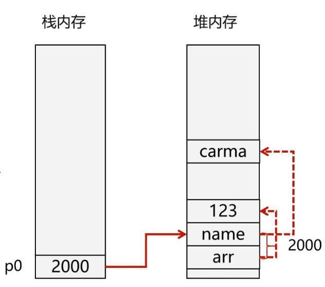  
接下来我们看子啊栈内存上就得出现p0这个变量，p0存储的就是当前Player对象的地址。  
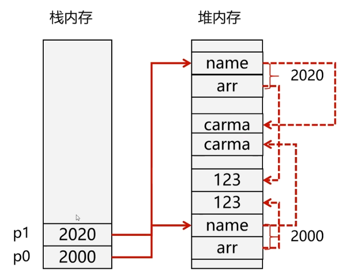  
接下来调用showMe()这个方法，也new出来一个Player对象，再在堆内存分配一块内存给它，地址是2020。  
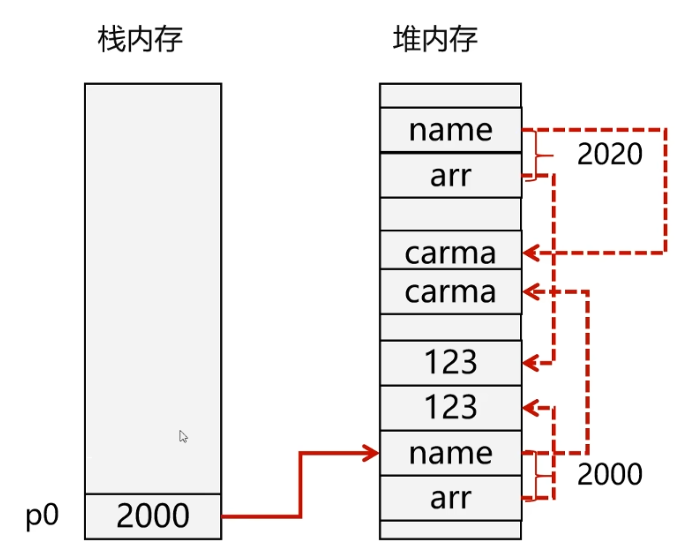  
接下来showMe()这个方法执行完毕。执行完毕之后它需要弹栈，把p1这个对象带走。
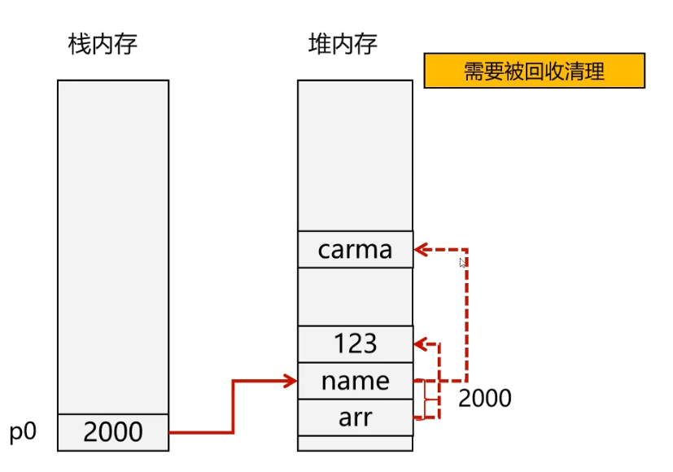  
p1带走之后，假设现在咱们的CLR刚好要去判断一轮，它回去看当前的时间点哪些内存需要被回收。p1变量消失，原来被p1引用的内存变成需要被回收清理的。因为我们还没有退出main方法，所以此时此刻p0还存在。  
#### 4 . Mark-Compact标记压缩算法
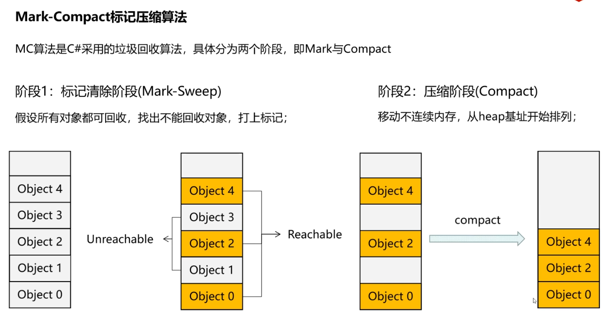  
假设咱们有这么一堆的在堆内存上的对象（Object0-Object4）假设都可以被回收，再从根对象开始一点点用刚才那套方法找，发现4号2号和0号是可达的，3号和1号是不可达的。

干掉不可达对象之后进入阶段2：压缩阶段。为什么会存在压缩阶段呢？之前我相信大家有过一定的windows电脑的使用经验，我们经常会使用一个清理磁盘的功能，在这个功能里面有一个东西叫磁盘碎片整理。在内存中也会存在这种情况，什么叫内存的碎片呢？这是一整块堆内存，已被分配使用的是4号2号和0号，随着下一次的内存使用，中间会有碎片，这些碎片大小不一分布各异零散分布其中。虽然它们加在一起剩余的空间很大，但是由于它们是一个一个小碎片，假如下一次我想分配一块稍大的内存，虽然剩余总内存加在一起可以给它分配，但是由于这些碎片是割裂的不连续的，所以没法找到一整块的内存给它分配。

遗留问题：原来的4号2号0号对象都在堆内存上，说明它们很有可能会被其他的引用变量引用。假如栈内存上的一个引用变量引用了Object2的内存，这个引用变量存着Object2的地址，你现在把Object2挪到了这里，改变了2号对象所存放的地址，原来栈上的对象在想访问堆上的Object2的话，访问不到了。所以同时得把地址这件事修复了。  

#### 5 . 地址修复
  
  
为什么黄色里面写个2012，意思是说：在2020这块对象内存里面有一个变量还引用着2012地址的内存。  
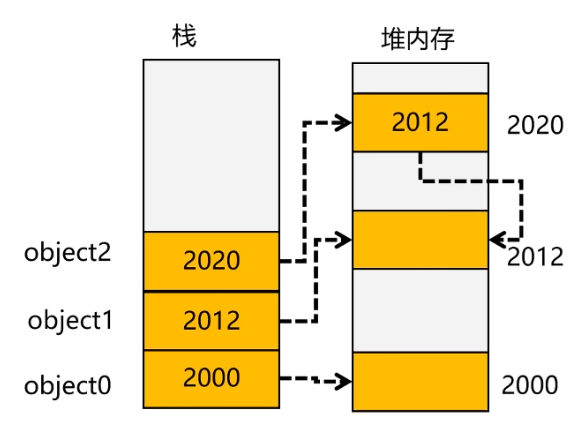  
上图是压缩之前的内存对应关系。  
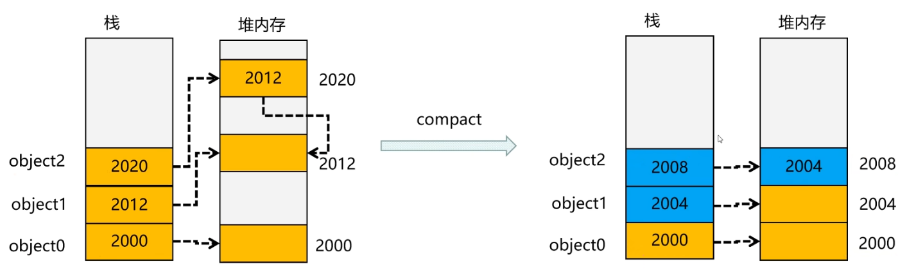  
#### 6 . 总结
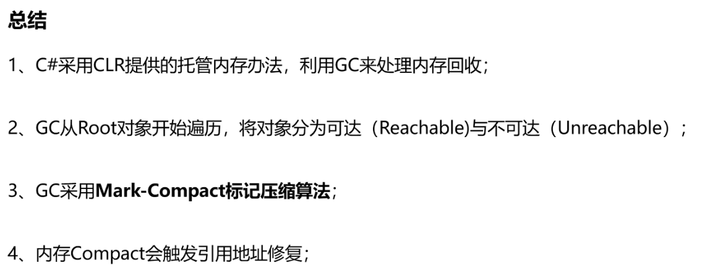  
