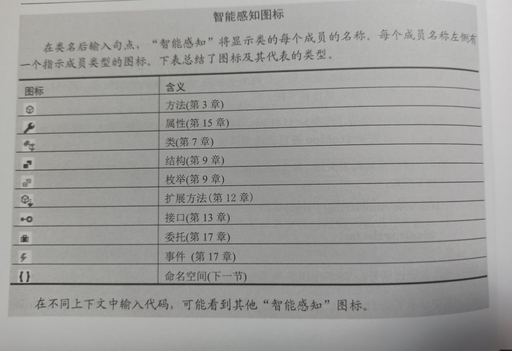
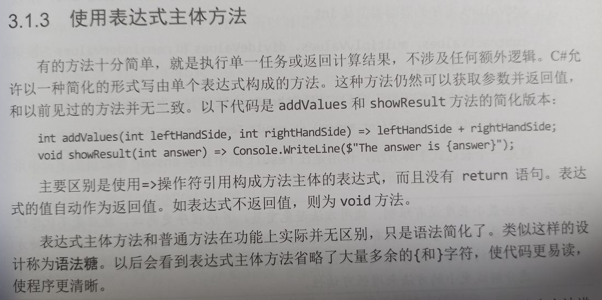
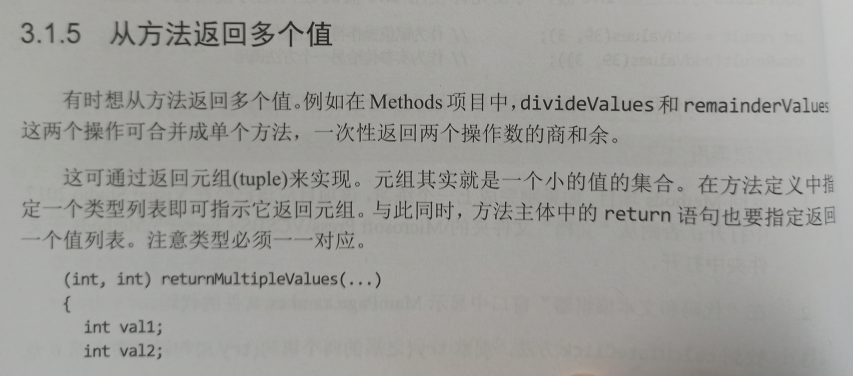
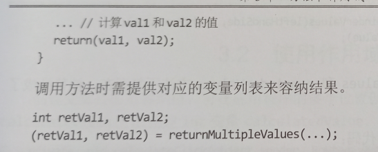
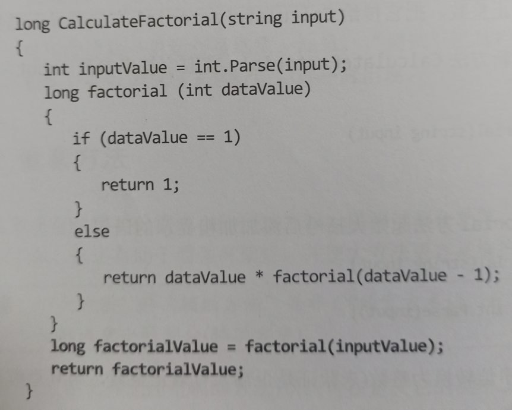
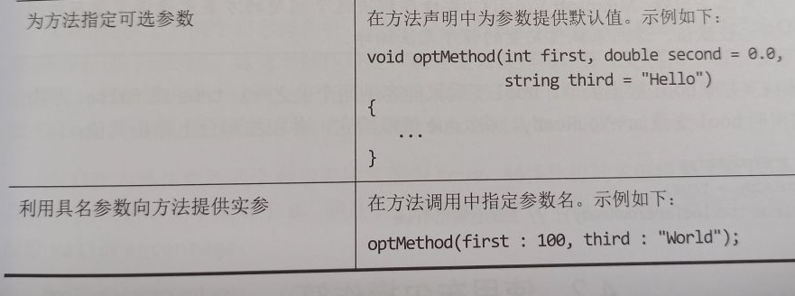

# Visual C# 从入门到精通（第9版）
## CHP1
### 1.2 写第一个程序
1 . Program.cs文件定义了Program类，其中包含了Main方法。C#的所有可执行代码都必须在方法中定义，而方法必须属于类或结构。（将在第七章讨论类，在第9章讨论结构）

Main方法指定程序入口。必须像本例的Program类那样把它定义成静态方法，否则应用程序运行时，.NET Framework可能不把它视为起点。（将在第3章讨论方法，在第7章讨论静态方法）

C#区分大小写。Main首字母必须大写。

2 . IntelliSense（智能感知）图标
  

### 1.3 使用命名空间
例如可能识图创建两个同名的类。解决方法：命名空间。  
作为好习惯，所有类都应该在命名空间中定义。  
using指令：用于将某个命名空间引入作用域。同一文件的后续代码不再需要哟个命名空间限定对象。  
注意：VS中某些using指令呈现灰色，表明当前应用程序未用到这些命名空间，写好程序后可删除。

## CHP2
### 2.3.1
不要以下划线开头。虽然在C#中合法，但限制了其他语言（如Visual Basic）的代码互操性。
### 2.5.1
.Net Framework提供了Int32.Parse方法。要对作为字符串存储的值执行算术运算，可先用Int32.Parse将其转换成整数值。

字符串插值（$）比+操作符高效得多。由于.Net Framework处理字符串的方式，用+来连接字符串可能消耗大量的内存。  

表达式5/2的结果是2。

C#允许float和double值使用取模（remainder）操作符。  
### 2.7 声明隐式类型的局部变量
var myVariable = 99; //ok  
var yetAnotherVariable; //wrong。因为没初始化。  
在C#中用var关键字声明变量折后，赋给变量的值的类型就固定下来，不能随便修改。   

## CHP3 

### 3.1.2
如果不希望方法返回数据（返回类型void），可利用return语句的一个变体立即从方法中退出：  
return;
### 3.1.3
表达式主体方法：  
  

```C#
private void showResult(int answer) => result.Test = answer.ToString();
```
这是一个表达式主体方法，作用是在result框中显示answer参数值的字符串形式。由于不返回值，所以方法返回类型是void。 

### 3.1.5 从方法返回多个值
元组
  
  

### 3.2 使用作用域
方法作用域  
类作用域  
### 3.2.2 定义类作用域
类定义的变量称为**字段**。  

方法中的变量必须先声明再使用，但字段不同，可在类的任何位置定义。可先在方法中使用字段，再在方法后声明字段，让编译器来打点一切！  

### 3.2.3 重载方法
但要注意，虽然能重载方法的参数，但不能重载方法的返回类型。也就是说，不能声明仅返回类型有别的两个方法。  

### 3.3 编写方法

对着还没声明的方法右键“快速操作和重构”

### 3.3.2 嵌套方法
大方法可以嵌套辅助方法。  
e.g.阶乘运算  
  

### 3.4.2 传递具名参数
  

## CHP4

### 4.2.3 短路求值
（percent > = 0）&&(percent <=100)  
当左边（）里是false，不会对右侧（）内表达式求值。 

（percent < 0）||(percent > 100)  
当左边是true不用对右边求值。  

所以右边的放复杂的表达式，可提升性能。  


