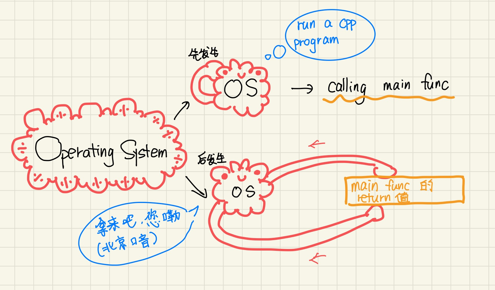

# Chapter 1 GETTING STARTED
compile and execute
## 1.1 Writing a Simple C++ Program
### 1.1.0 操作系统与main的互动/ statement
1 .   
Every C++ program contains one or more functions, one of which must be named **main**.   
The operating system runs a C++ program by calling **main**.     
Here is a simple version of main that does nothing but return a value to the operating system.    
```C++
int main(){
    return 0;
}
```
【可知】  
  

小彭老师补充：  
并不是os调用main，是os调用了libc的_start，_start调用了main，_start得到main的返回值后，返回给操作系统。  
_start存在的目的是，在main启动之前，初始化一些系统资源和全局变量，比如stdin，std::cout，并在main退出后，析构所有全局变量   

2 .   
The only statement in this block is a **return**, which is a statement that terminates a function.    
Semicolon at the end of the **return** statement. Semicolons mark the end of most statements in C++.     
- 【statement】: 语句！

### 1.1.1 Compiling and Executing Our Program
Many PC-based compilers are run from an integrated development environment(IDE) that bundles the compiler with build and analysis tools.    
Most compilers expect program source code to be stored in one or more files.  
Program files are normally referred to a source files.  
In C and C++, the suffix ".c" and ".cpp" are used for C and C++ source code files, respectively.   
The compiler generates an executable file. On a Windows system, that executable file is named prog1.exe (generated from prog1.cpp).  
The most common compilers are the GNU compiler and the Microsoft Visual Studio compilers.   
GCC stands for 'GNU Compiler Collection' GNU编译器套装。


<br/>

**粗体文本**

</br>

<stdio.h>里有
```C++
#ifndef_STDIO_H_
#define_STDIO_H_
//...
#endif
```


