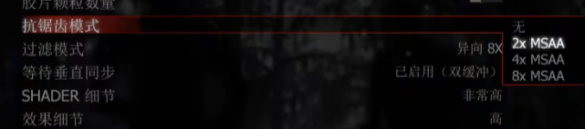

## DLSS相关
参考资料：  
1 . 【硬核科普】免费提升画质和帧数？详解DLSS2.0的工作原理与作用--up: 硬件茶谈  
BV1PA41187g2

2 .  知乎：如何评价英伟达推出的 DLSS3.5?  
https://www.zhihu.com/question/618638060/answer/3220054845

### 一 . 问题来源
  
  
  
   
  

FSR2 是 AMD **开源**的超分辨率方案，通过复用历史帧的信息，从低分辨率图像重建高分辨率图像。  

fsr是A卡的超分辨采样技术，dlaa是N卡的超采样技术，怎么转接？  
【鸦】经过查资料发现：The basic FSR is available for all hardware so it wasn't an AMD selling point in the first place.  

【鸦疑问】：reflex包含在dlss里面么？  

### 二 . 硬件茶谈内容
1 . N卡的20系显卡相对于10系显卡，在显卡核心内增加了:  
（1）RT Core 用于实时光线演算功能  
（2）Tensor core （张量计算核心）作用：增加显卡的AI深度学习计算功能。   

2 . DLSS两个关键点：深度学习，采样率
  

**采样率**  
玩游戏时如果分辨率不高，比如说是1080p或者2k没有到达4k。  
会发现锯齿：  
  

你的屏幕分辨率也是有限的，你不可能在一个低分辨率的显示器上，完美还原出高于你显示器分辨率的图像。  
衍生出一些解决方法（抗锯齿），帮助你在分辨率与性能消耗之间寻找一个平衡。  
  
  
  

【鸦小结】：采样率低导致锯齿，有专门的各式各样的AA算法。  

3 . 我们本期视频所要介绍的DLSS，**其中一个应用DLAA**（深度学习抗锯齿）就是抗锯齿大家族中的一员。  

DLSS1.0的实现分为两个阶段：一个是训练阶段，一个是使用阶段。 

在训练阶段我们需要让AI看很多原生1080P的游戏画面，然后再给AI看相同画面下8K分辨率的游戏画面，让Ai自己总结从1080p到8K发生了什么变化。

使用阶段则是把这个算法融入显卡驱动和游戏引擎，在游戏运行的时候，利用tensor core和算法把低分辨率的图形经过AI脑补到高分辨率上。  
  

【鸦小结：】DLAA就是1080p的源靠ai脑补到4k后再压回1080p显示器所需要的1080p。鸦瞎概括：深度学习超采样的目的是为了抗锯齿。

4 . DLSS2.0的实现原理和1.0截然不同，不是升级迭代的关系，它相对于AI的利用完全是换了一个角度。不靠AI脑补，而是借助AI完成多帧合成，在渲染画面的时候，显卡将不再对全屏幕进行采样。  
实际比这个例子复杂：  
对屏幕进行ABCD四个分区  
  
第一帧：AD区域采样：  
  
第二帧渲染时对BC区域进行采样  
  
最后进行合并。  

TAA：多帧合成，静态画面时好使用。但是画面动起来就会出现鬼影。在以前我们只能通过手调算法取优化改善鬼影。  
文章链接：TSR,FSR,DLSS超级分辨率的原理分析：  
https://blog.csdn.net/llsansun/article/details/139483585  

DLSS2.0：基于TAA多帧合成进行改进，将原来用来优化鬼影的算法，从人工手调变成了AI实时演算。  

5 . 因为DLSS1.0和2.0是截然不同的实现方式，已经支持DLSS1.0的游戏，必须要进行新的SOK开发优化才能接入2.0。  

### 三 . 知乎内容  
DLSS 1～2 本质上是**超分辨率技术（Super Resolution）**  

DLSS 3本质上是**插帧技术（Frame Generation）**，是RTX 40系显卡独占技术。DLSS 3在两个渲染帧中生成新帧的技术。GPU基于深度学习算法对两个渲染帧的信息来判定新帧，所以这个新帧又被称为AI生成帧，最高能够带来100 %的帧数加成。

DLSS 3.5据说是**光线重构技术（Ray Reconstruction）**，也是所有RTX显卡都支持。通过光线追踪降噪器增强光追的质量，光线追踪降噪器是英伟达的用HPC训练出来的。这项技术只有在光追的时候才能开，在帧数提升上不明显，有的游戏可能没有帧数提升，因为重点是放在光追效果上。

以上技术名称都叫DLSS，本质上不是同一项技术，甚至是相互独立的。唯一共同点就是都和深度学习&人工智能相关，所以都统称为DLSS（Deep Learning Super Sampling）了。  

因此，在支持DLSS 3.5的游戏中，Super Resolution、Frame Generation、Ray Reconstruction大概率是三个独立的选项，你可以同时开启，你也可以随意关闭某一项。

### 四 . 鸦瞎总结：
DLSS 1～2 是超分辨率技术，但是采用的技术不同，一个靠脑补达到抗锯齿，一个靠多帧合成（基于TAA）达成抗锯齿。

DLSS 3 加了帧生成，DLSS 3.5加了光线重构技术。它们和DLSS（Deep Learning Super Sampling）中的Super Sampling无关，但是和DL有关，就都并过来了。哈哈哈哈哈。  