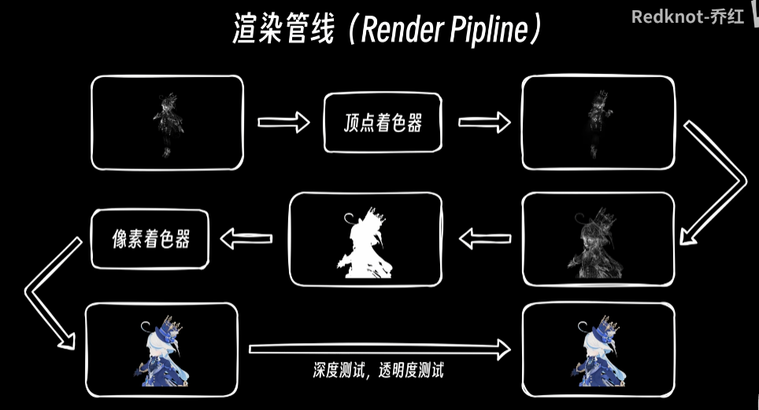

## 为什么游戏总要编译着色器？
问题来源：  
  

  

参考资料：  
BV1zi421h7tJ  
BV1NFs2eoEjC  
  

### 一 . 手机端
#### 1 . 图形接口用处
假如你是一个游戏开发者，你开发的游戏要运行在显卡上面，现在市面上有五款显卡，你的游戏就必须兼容这5款显卡，你就要写5份兼容代码。这太愚蠢了。

我们可以制定一个标准，制定一套接口，让所有的显卡生产厂商都实现这套接口，让所有的软件开发者都调用这套接口。  
  

#### 2 . 着色器是什么
可编程管线就是你可以写一小段程序，然后把这段程序拿到GPU的核心上去跑。
从而实现对GPU的可编程，这段小程序被称为shader。  
  
  

【鸦补充：】OpenGL干的核心的几大活之一就是图形渲染管线。

渲染管线的主要职责是处理从三维场景到二维图像的转换过程，包括顶点数据的输入、顶点着色、几何变换、光栅化、片段着色以及最终的图像输出。
#### 3 . DX横扫PC, OpenGL退居移动
两个问题：
（1）为什么只在第一次进入需要编译
（2）为什么游戏开发者不能把Shader预先编译好，然后放到游戏包里边。这不比我们开游戏的时候再编译会更好吗？

Direct3D 靠着微软的强力支持，很快在游戏领域成为了唯一选择，而OpenGl因为早年的积累和开放的特点，在专业图形工作站领域（e.g. MAYA）则更加受欢迎。

不过岂能事事都随了微软的愿，2007年苹果发布了iphone，世界很快进入移动互联网时代，对于当时的ios和android来说，搭载openGL是唯一的选择。
【鸦补充】OpenGL开源，跨平台兼容，而DX只在win机上使用。  

于是在大约2010年前后，ios和Android都搭载了经过精简的OpenGL ES标准。于是OpenGL ES开始在移动设备上大放异彩。  

所以Direct3D统治桌面PC。OpenGL和OpenGL ES统治移动设备，外带mac、linux等。    
  

#### 4 . 问题解答：为什么只在第一次进入需要编译
在OpenGL ES 3.0中出现了一个新特性：Shader缓存机制。  
在OpenGL较早的版本中，Shader是以源代码的形式存放在程序里面的，在程序运行的时候就需要拿出来进行编译。但是早期的OpenGL在Shader编译之后，会直接扔给显卡去执行，并不允许将编译后的产物给缓存起来，这就导致程序每次运行的时候都要对Shader进行重新编译。这也就是大部分老游戏不会专门显示正在编译着色器的进度条，每次进来都得编译。【鸦疑问：老游戏也是每次打开游戏都编译所有shader的意思么？而不是要用到该shader再编译么？】
  

Shader缓存机制
下次再进来的时候直接从磁盘里面读取编译产物。  
  
这也就是很多近几年出的游戏会在第一次载入游戏的时候把所有的shader都编译一遍。

#### 5 . 问题解答：为什么游戏开发者不能把Shader预先编译好，然后放到游戏包里边
为什么不像下图那样做呢？  
  

先说结论：在OpenGL里面这样做是不可以的。  

##### 角度1 OpenGL只规定了Shader源代码的格式
   

OpenGL的标准里面只规定了Shader源代码的格式，但是病灭有规定编译之后的机器指令的格式，所以这些机器指令格式在不同品牌的GPU上运行的时候，其格式也是不同的。means:你用A机器编译出来的指令放到B机器上面是跑不起来的。  
不同的品牌的机器：  
  

所以使用OpenGL的游戏里面只能包含Shader的源代码。

##### 角度2 OpenGL没法中间格式
让所有硬件厂商按照统一的机器码指令去制造硬件，实在是强人所难，但是我们可以退一步。我们可以在Shader源代码到机器码之间增加一种新的中间格式（有点像汇编代码），**这种中间格式不能直接送给硬件去执行**，但机器友好格式，比编译人写的shader快的多。   
  
但是OpenGL ES 3.0里面不支持。OpenGL需要**革新**。   

#### 6 . 新时代革新
Direct3D 12  
Vulkan  
Metal  
在设计的时候，都考虑到了我们刚才说的Shader的中间格式：  
  

可以把中间格式放到安装包里，但不代表一定这么做。  
  
右边的中间格式比源代码大了3倍。所以当你的Shader特别多的时候，选择在用户的设备上面进行编译可以减小安装包的体积，可以节省流量。

### 二 . PC端(win)  
#### 1 . DX11和DX12的不同
Direct3D 和 OpenGL不同的是：Direct3D 11除了规定Shader源代码的语法之外，它还推出了一种预编译格式叫做DXBC（中间格式）。

DX12则用DXIF(中间格式)取代DXBC。

#### 2 . PSO Cache 
  

这条渲染管线自定义数据除了Shader之外还有很多的状态需要设置：  
  
在DX12之前，渲染管线都是在运行的时候实时构建的，有时候你需要进行几十次的调用才能完成这个构建，并且每次调用，GPU都要对你的操作进行大量的校验工作，防止非法操作把系统给干崩溃。  
  
构建耗时，所以在一些老游戏里面，当画面上出现一个新的物体的时候就会卡一下。  

DX12改进了这一点，你可以在第一次运行游戏的时候，构建一个管线，把管线里用到的shader，各种状态的设置都做了，显卡也会对你的操作进行校验来防止出错。然后显卡把你的管线生成一段直接可以跑在显卡上面的机器码，显卡会允许游戏开发者把这段机器码给缓存下来，等到下次运行的时候，游戏可以直接将这段机器码塞给显卡。就不用费劲地再构建一个管线。  
  
这个过程叫做：PSO Cache  
【鸦say：】  
注意看图：PSO的机器码是在显卡之后生成的。DXIL中间格式是在显卡之前desu。   
  

所以现在很多Direct3D开发的游戏表面上写的是正在编译着色器，实际上是在做PSO的缓存。这个PSO缓存和硬件是强绑定的，不同的显卡甚至不同版本的显卡驱动生成的PSO缓存也是不能通用的。所以当你更新了显卡驱动之后，你大概率还需要再尽力一次"正在编译着色器"。  

#### 3 . 为什么革新后PC还是要长长等待预编译
DXIL -->  PSO 其实不需要让用户等十几分钟。之所以要等那么久是因为很多游戏内置的Shader仍然是Shader的源代码，而不是DXIL。  
所以这里的编译着色器，实际上是把源代码先编译成DXIL 或者 DXBC，然后再去构建PSO缓存。  
  
【鸦疑问：不是说PSO是DX12出的么？怎么DXBC也能用了？】  

可是为什么不用中间格式：  
（1）安装包体积问题（非主要原因）  
（2）DX11用的预编译格式是DXBC，DX12用的是DXIL。DXBC和DXIL是互不相通的。游戏安装包里放DXBC，图形接口只能用DX11。 游戏安装包里放DXIL，图形接口只能用DX12。
而有一部分老电脑是不支持DX12的，总不能放弃这部分用户吧。  

  

### 三 . 总结  
  
TLTR版总结：
从代码到GPU是这样的流程：

【表示在安装包中已经做好】

【游戏中的Shader源代码-->编译Compile-->中间格式（可以加快进度）】-->编译Compile-->生成编译产物（机器码：GPU能读懂的）-->GPU

手机端的图形接口一般是OpenGL ES。而OpenGL没有中间格式，所以手游只能慢慢预编译着色器。

而PC端DX11和12都有中间格式。照理说可以不用慢慢预编译啊。
但是  
（1）安装包体积问题，中间格式体积大（非主要原因）  
（2）DX11用的预编译格式是DXBC，DX12用的是DXIL。DXBC和DXIL是互不相通的。有一部分老电脑是不支持DX12的。  

### 四 . 问题   
【鸦疑问：老游戏也是每次打开游戏都编译所有shader的意思么？而不是要用到该shader再编译么？】
  
