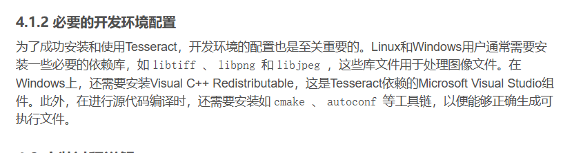

### 网易云歌词图片识别
1 .   
  

代码如下：  
```python
import os
from PIL import Image
import pytesseract

# 设置Tesseract可执行文件的路径（根据你的安装路径进行修改）
pytesseract.pytesseract.tesseract_cmd = r'D:\Software\forStudy\Tesseract_OCR\tesseract.exe'


def extract_song_names_from_images(image_folder, output_file):
    # 打开输出文件
    with open(output_file, 'w', encoding='utf-8') as f:
        # 遍历图像文件夹中的所有文件
        for filename in os.listdir(image_folder):
            if filename.lower().endswith(('.png', '.jpg', '.jpeg', '.bmp', '.gif', '.tiff')):
                # 构建图像的完整路径
                image_path = os.path.join(image_folder, filename)

                # 打开图像
                img = Image.open(image_path)

                # 使用Tesseract进行OCR识别，指定语言模型（可以添加多个语言，如'eng+rus+jpn'）
                text = pytesseract.image_to_string(img, lang='eng+rus+jpn+chi_sim')

                # 假设歌名在识别出的文本中，你可以根据需要进一步处理文本
                # 例如，使用正则表达式来提取特定的歌名格式
                f.write(text.strip() + '\n')
                print(f"Processed {filename}")


if __name__ == "__main__":
    image_folder = r'D:\MygroupFriends2024Music'  # 替换为你的图像文件夹路径
    output_file = 'song_names.txt'  # 输出TXT文件的路径
    extract_song_names_from_images(image_folder, output_file)
    print("Processing completed. Song names have been saved to", output_file)
```

2 .   
  

3 .   
  
  
  
  
更改成你下的解释器的位置。  

4 .   
  
【鸦补充：其实不用上面那么麻烦，按照1 .中ai说的那么做就行了。  
  
  

5 .   
pip快一点的方法。  
  

6 .   
  
  

7 .  我下载的tesseract没有语言扩展包  
  
所以我去外面下了语言扩展包：  
https://blog.csdn.net/qq_47571357/article/details/132017514  
直接复制到：  
D:\Software\forStudy\Tesseract_OCR\tessdata  
这个地址底下。  

8 .然后再用代码调用AI接口，向AI提问。  
```python
import os
import openai

os.environ['OPENAI_API_KEY'] = 'sk-6016da4740a14de08c591278eb6684c0'
os.environ['OPENAI_BASE_URL'] = 'https://api.deepseek.com/v1'

client = openai.OpenAI()


input_file = 'song_names.txt'
output_file = 'outputSongsName.txt'

# 打开原始TXT文件并读取内容
with open('song_names.txt', 'r', encoding='utf-8') as original_file:
    content = original_file.read()


def ask(question):
    response = client.chat.completions.create(
        model="deepseek-chat",
        messages=[
            {"role": "system", "content": "You are a helpful assistant"},
            {"role": "user", "content": question},
        ],
        stream=False
    )
    return response.choices[0].message.content


processed_content = ask('从下一个"niyaochulidewenziruxia"开始是你要处理的文本，处理文本要求：请将以下由图片识别的文字文本其中是歌名的部分转换成这种格式："歌名:歌手名字\n"输出字符串。有些文本只有歌手名字，文本附近没有歌名的，请选取该歌手三个热门歌曲按照以上格式输出字符串。niyaochulidewenziruxia\n'+content)


# 将处理后的内容写入新的TXT文件
with open('outputSongsName.txt', 'w', encoding='utf-8') as processed_file:
    processed_file.write(processed_content)

# 文件会在with语句块结束时自动关闭
```

这个key可以42.58 万个单词。  

9 . 一些思考：  
（1）格式："歌名:歌手名字\n"
的冒号是否换成\t识别出的更多。  

（2）第一遍outputSongsName.txt里也有很多乱码，是否下次可以让ai二次洗一下文本。  
