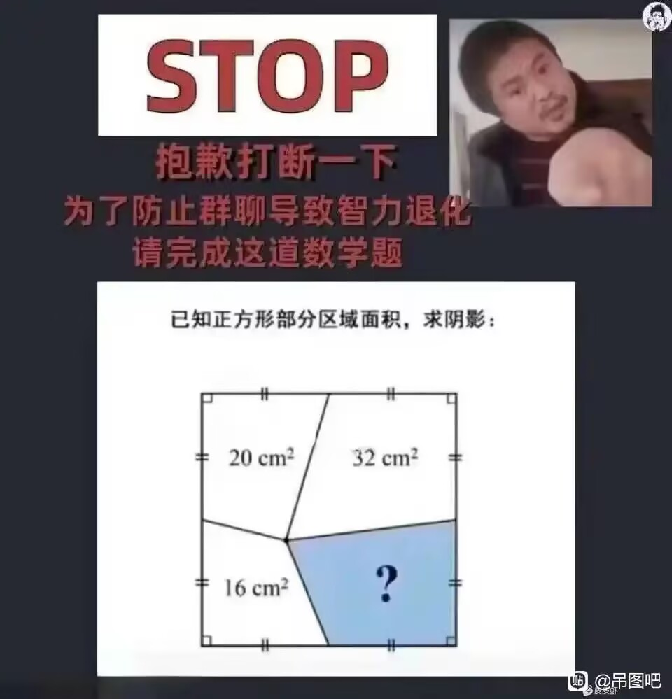
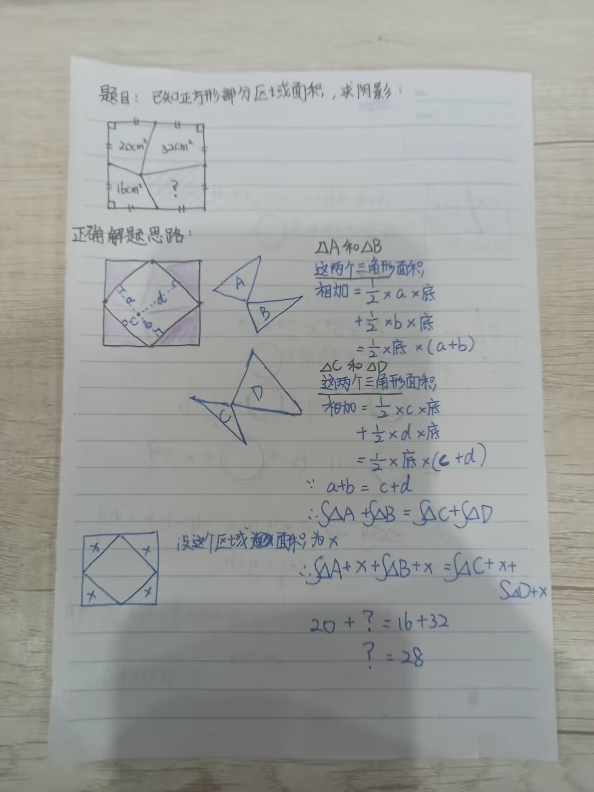
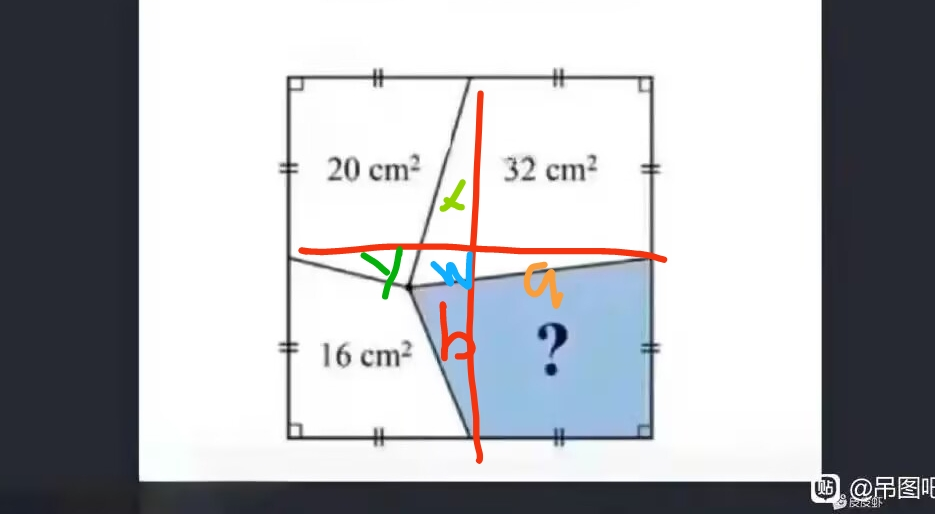
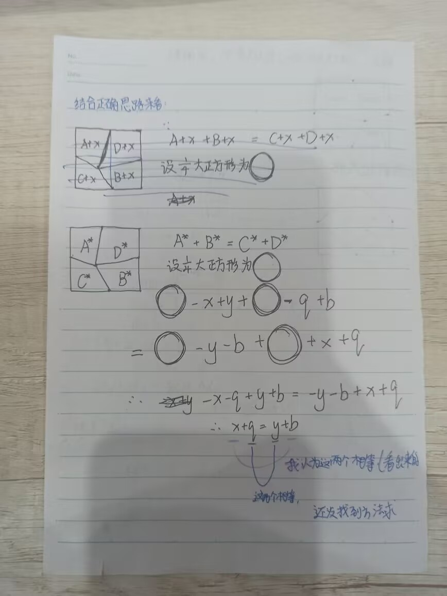
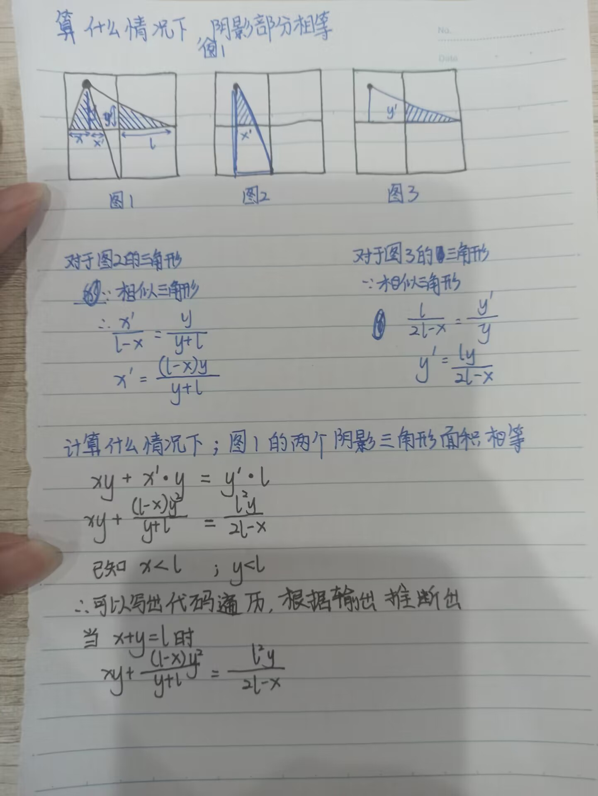

### 群里阴影部分面积问题
问题是这个：  
  

#### 1 . 正确的解法
  

#### 2 . 老鸦的思路
  

一开始的想法是：  
把大的正方形分成四个小正方形。  
每个小正方形互相相等。  
所以：  
20+x-y =  
32-x-w-q =   
16+y+w+b =   
? -b+q  
  
思路1：    
又因为光看上边那一半：  
20+32 = 大正方形一半的面积 + y + w + q  
光看左边那一半：  
20+16 = 大正方形一半的面积 - x - w - b   
  
总式子1：将这两个式子相加为：    
52+36 = 一整个大正方形面积 + y +q - x - b   
  
所以我就想去求 y +q - x - b   
因为20+x-y =? -b+q  
所以y+q-x-b = 20-?  
  
带入为总式子1：0=0------->没解出来任何数字  
  
思路2：    
将【20 x 32】的含义定位含20的式子 = 含32的式子  
所以：  
20+x-y = 32 - x - w -q  
所以：  
12 = 2x - y +w +q  
  
【20 x 16】:  
20+x-y = 16+y+w+b  
4 = 2y + w + b - x  
  
【32 x 16】：  
32-x-w-q = 16 + y + w + b  
16 = 2w + x + y =b + q  
  
所以：  
【20 x 32】-->12 = 2x - y +w +q          （式1）  
【20 x 16】--> 4 = 2y + w + b - x         （式2）  
【32 x 16】-->16 = 2w + x + y =b + q （式3）  
  
式1推出  q = 12- 2x+y-w  
式2推出  b = 4+x-2y-w  
  
【20x32】x【32x16】-->28 = 3x + 3w + 2q+b       （式4）  
【32x20】x【20x16】-->【32x16】  
【32x16】x【16x20】-->20 = 3w + 3y + 2b + q     （式5）  
将q = 12- 2x+y-w  
b = 4+x-2y-w  
带入式3，式4，式5  
均无法推出结果。    
  
--------------------------------------------------------------------------  
思路1思路2总结：  
20+x-y =  
32-x-w-q =   
16+y+w+b =   
? -b+q  
  
可以设 A = 20+x-y  
B = 32-x-w-q  
C = 16+y+w+b  
D = ? -b+q  
  
A = B为一个式子  
A = C为一个式子  
A = D为一个式子  
B = C为一个式子  
B = D为一个式子  
C = D为一个式子  
看似是6个式子6个未知数x,y,w,q,b,？  
但其实只有3个式子，因为只有下面三个式子有用：  
A = B为一个式子  
A = C为一个式子  
A = D为一个式子  
  
用代码实际算一下思路2那些式子推导的对不对，比如带入后的式子。   
用线性代数实际去跑一下为什么思路1，思路2不行。    
  
-------------------------------------------------------------------------------  
思路3：  
因为正方形的面积为边长的平方。  
所以：  
根号下（20+32+16+？） = something  
由图示可以看出：  
? > 16  
? > 20  
? < 32  
假设something为整数。用代码跑一下？等于什么合适。  
21跑到31遍历一遍。  
  
--------------------------------------------------------------------------------  
思路1和2结合正确思路来看：  
20+x-y =  
32-x-w-q =   
16+y+w+b =   
? -b+q  
  
可以看出  
  
  

  

代码如下：  
```C++
#include <iostream>
#include <cstdlib>
using namespace std;
int main() {
  for(int ll = 2; ll <= 10; ll++){

    for(int xx = 1; xx < ll; xx++){
      for(int yy = 1; yy < ll; yy++){
        float x = (float)xx;
        float y = (float)yy;
        float l = (float)ll;
        if(abs(x*y + (l-x)*y*y / (y+l) - l*l*y/(2*l-x)) < 0.00001f){
          cout<<"left  "<< x*y + (l-x)*y*y / (y+l)<<endl;
          cout<<"right "<< l*l*y/(2*l-x)<<endl;
          std::cout << x << " " << y << " " << l << std::endl;
        }
      }
    }

  }
  return 0;
}
```
输出结果：  
```
left  1.33333
right 1.33333
1 1 2
left  3.6
right 3.6
1 2 3
left  2.25
right 2.25
2 1 3
left  6.85714
right 6.85714
1 3 4
left  5.33333
right 5.33333
2 2 4
left  3.2
right 3.2
3 1 4
left  11.1111
right 11.1111
1 4 5
left  9.375
right 9.375
2 3 5
left  7.14286
right 7.14286
3 2 5
left  4.16667
right 4.16667
4 1 5
left  16.3636
right 16.3636
1 5 6
left  14.4
right 14.4
2 4 6
left  12
right 12
3 3 6
left  9
right 9
4 2 6
left  5.14286
right 5.14286
5 1 6
left  22.6154
right 22.6154
1 6 7
left  20.4167
right 20.4167
2 5 7
left  17.8182
right 17.8182
3 4 7
left  14.7
right 14.7
4 3 7
left  10.8889
right 10.8889
5 2 7
left  6.125
right 6.125
6 1 7
left  29.8667
right 29.8667
1 7 8
left  27.4286
right 27.4286
2 6 8
left  24.6154
right 24.6154
3 5 8
left  21.3333
right 21.3333
4 4 8
left  17.4545
right 17.4545
5 3 8
left  12.8
right 12.8
6 2 8
left  7.11111
right 7.11111
7 1 8
left  38.1176
right 38.1176
1 8 9
left  35.4375
right 35.4375
2 7 9
left  32.4
right 32.4
3 6 9
left  28.9286
right 28.9286
4 5 9
left  24.9231
right 24.9231
5 4 9
left  20.25
right 20.25
6 3 9
left  14.7273
right 14.7273
7 2 9
left  8.1
right 8.1
8 1 9
left  47.3684
right 47.3684
1 9 10
left  44.4444
right 44.4444
2 8 10
left  41.1765
right 41.1765
3 7 10
left  37.5
right 37.5
4 6 10
left  33.3333
right 33.3333
5 5 10
left  28.5714
right 28.5714
6 4 10
left  23.0769
right 23.0769
7 3 10
left  16.6667
right 16.6667
8 2 10
left  9.09091
right 9.09091
9 1 10
```